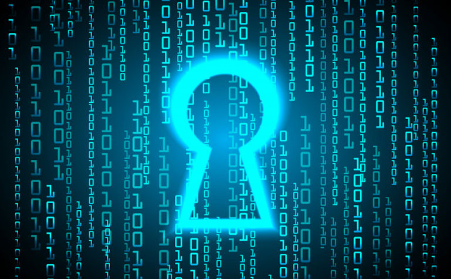

 # <h1 align="center"> Decodificaror de texto Alura Oracale </h1>
 

Aplicativo de criptografia, desenvolvido para o desafio de Alura.

 

 
<h2 align="center">
    
</h2>

  

    

🚀 Tecnologias utilizadas

✔️ HTML5

✔️ CSS3

✔️ JavaScript
 

 

## Descrição

As "chaves" de criptografia que utilizaremos são:
* A letra "e" é convertida para "enter"
* A letra "i" é convertida para "imes"
* A letra "a" é convertida para "ai"
* A letra "o" é convertida para "ober"
A letra "u" é convertida para "ufat"
  

## Requisitos

- Deve funcionar apenas com letras minúsculas
- Não devem ser utilizados letras com acentos nem caracteres especiais
- Deve ser possível converter uma palavra para a versão criptografada e também retornar uma palavra criptografada para a versão original.

Por exemplo:
"gato" => "gaitober"
gaitober" => "gato"

* A página deve ter campos para inserção do texto a ser criptografado ou descriptografado, e a pessoa usuária deve poder escolher entre as duas opções
* O resultado deve ser exibido na tela.
  

 👀 Visualize o projeto   
    <a href="https://lucianojunnior17.github.io/Challenger-Alura---Decodificador/">Aqui</a>
 

 

### Extras:
- Um botão que copie o texto criptografado/descriptografado para a área de transferência - ou seja, que tenha a mesma funcionalidade do ctrl+C ou da opção "copiar" do menu dos aplicativos.

:construction: Projeto em construção :construction:

